<div align="center">



</div>

### `sandeep@github ~ $ ./init_profile.sh`

# Sandeep Kumar Sahu

**B.Tech CSE @ Veer Surendra Sai University of Technology (VSSUT), Burla**  
Cybersecurity | AI/ML | Web Development | Cloud | Automation | Browser Agents



<table>
  <tr>
    <td width="42%" valign="top">
      
    </td>
    <td width="58%" valign="top">

### `sandeep@github ~ $ whoami`

I am a Computer Science and Engineering student at VSSUT with a focus on building practical systems across cybersecurity, AI/ML, web platforms, cloud/serverless architecture, automation, and browser agents.

Current academic status: **4th semester completed**  
Current CGPA: **8.63 / 10**

I like projects where software meets real-world safety: phishing detection, browser automation, digital safety tooling, and intelligent systems that help people make better decisions.

  </td>
  </tr>
</table>

### `sandeep@github ~ $ ls ./projects`

| Project | Focus | Stack |
| --- | --- | --- |
| **AEGIS** | AI-powered digital safety platform with phishing URL detection, suspicious message/spam detection, password exposure checking, security guidance, digital safety scoring, and serverless AWS backend. | Python, scikit-learn, React, Vite, Tailwind CSS, AWS Lambda, API Gateway, Groq |
| **TabMind** | AI-powered Chrome Manifest V3 browser agent with context awareness, session memory, workspace restoration, research automation, tab organization, duplicate tab handling, WebCMD execution, and optional AI summaries. | TypeScript, React, Chrome Extension APIs, Vite, Node.js, WebCMD |
| **ElderCare+** | Senior-care companion platform to help elderly users access useful services, assistance, and care-related resources. | Senior-care platform |
| **GreenLedger** | Blockchain-based agricultural supply-chain transparency using traceability, QR/NFC identification, smart contracts, blockchain verification, and IoT data ingestion. | Blockchain, Polygon, Smart Contracts, IoT |
| **Network Intrusion Detection** | Machine-learning project focused on classifying suspicious or malicious network traffic. | Python, scikit-learn, Pandas, NumPy |

### `sandeep@github ~ $ cat achievements.log`

- ElderCare+ achieved **8th position at Hack Odisha 5.0**.
- Cyber Security Lead.
- Enigma, Web & Coding Club of VSSUT: Outreach Head.
- Active NSS Member.
- Hackathon participant / builder.

### `sandeep@github ~ $ cat internships.txt`

- Web Development, IBM / AICTE, 6 weeks
- Cyber Security with Generative AI, VOIS, 4 weeks
- Artificial Intelligence & Machine Learning, IBM, 6 weeks

### `sandeep@github ~ $ cat skills.txt`

| Area | Technologies |
| --- | --- |
| Programming | Python, JavaScript, TypeScript, SQL |
| Web | React, Vite, Tailwind CSS, Node.js |
| AI / ML | Python, scikit-learn, Pandas, NumPy, Machine Learning, NLP |
| Cloud | AWS Lambda, API Gateway, ECR, IAM, CloudWatch, Docker |
| Cybersecurity | Phishing detection, digital safety, network security, security automation |

### `sandeep@github ~ $ ./current_focus.sh`

```text
> sharpening cybersecurity + AI/ML fundamentals
> building AEGIS as a practical digital safety platform
> building TabMind as a browser-agent workflow system
> exploring cloud/serverless and deterministic browser automation
```

### `sandeep@github ~ $ ./connect.sh`

- GitHub: [github.com/sandeep0431](https://github.com/sandeep0431)

```text
sandeep@github ~ $ echo "building at the intersection of software, AI and cybersecurity."
```
